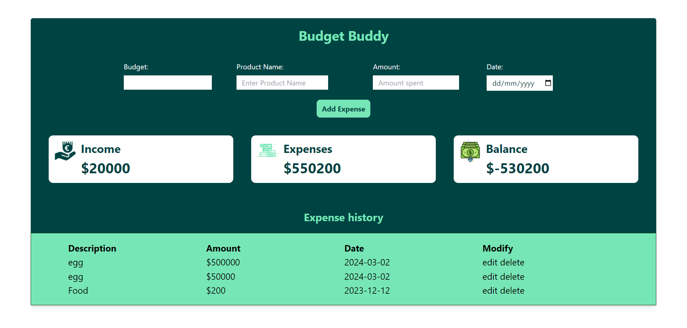
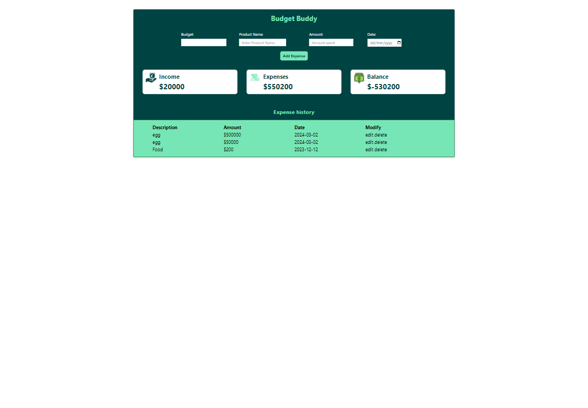
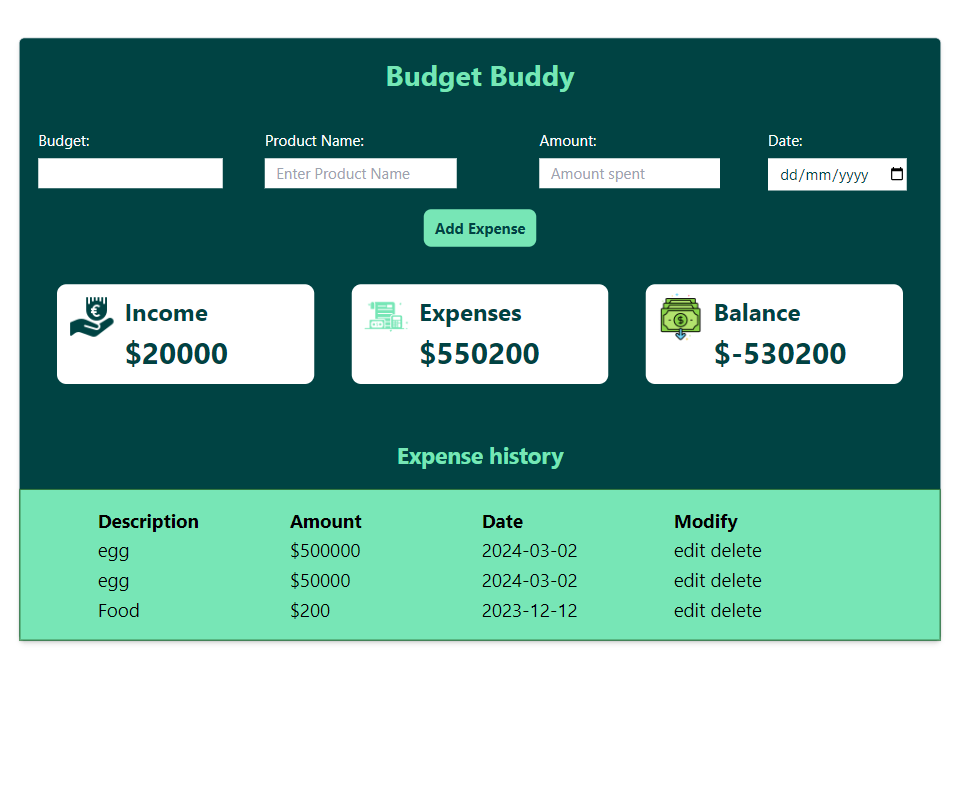
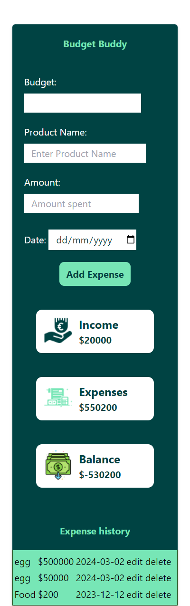
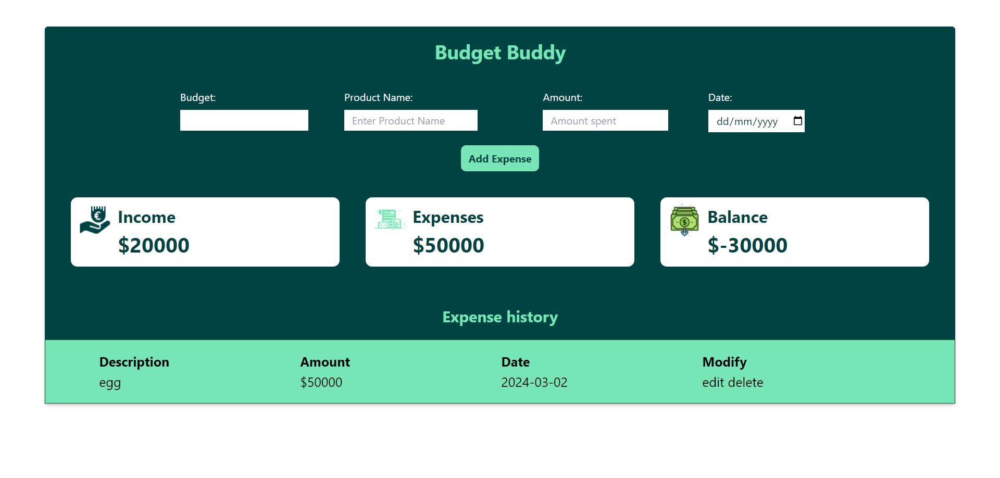
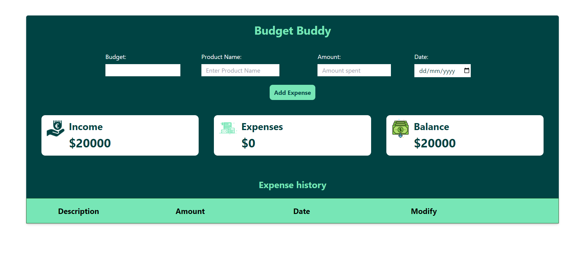

# Budget Buddy

## Table of Contents

1. [Introduction](#introduction)
2. [Features](#features)
3. [Getting Started](#getting-started)
4. [User Guide](#user-guide)
5. [Installation](#installation)
5. [Code Overview](#code-overview)
6. [Technologies used](#technologies-used)
7. [Screenshots](#screenshots)
8. [Get In Touch](#get-in-touch)


### Introduction 



Welcome to Budget Buddy App, a personal finance management tool designed to help you monitor and control your expenses. Users can add, edit, and delete expenses, and the application calculates the total income, total expenses, and the remaining balance, It also throw a negative balance when you spend beyond your income. All data is stored in the browser's local storage, ensuring that the information persists across sessions.

The Budget Tracker is a simple web application that helps users manage their expenses and income.

## Features

- User friendly interface for easy data entry
- Add new expenses with description, amount, and date.
- Track total income and expenses
- Delete expenses.
- Edit existing expenses.
- Calculate and display total expenses and balance.
- Responsive design using Tailwind CSS.

## Getting Started

To get started, simply click on the link (BudgetBuddy)[https://budget-buddyr.netlify.app/] 

## User Guide

- Tap the budget input field to add a the income you want to budget
- Write the description of your expense in the description input field
- Enter amount spent in the amount field
- Enter the date and click on
- Add Expense
- The history will display in the expense history, then you can edit or delete
- To edit click on edit
- To delete click on delete

## Installation
 
 - Clone the repository:

```bash
git clone https://github.com/Ehmkayel/BudgetBuddy.git

```
- Navigate to the project directory:
```bash
cd BUDGETBUDDY
```

- Open the index.html file in your preferred browser.


## Code Overview

- I started by installing Tailwind Css, then I configured by Tailwind Css, I made a sketch of how the website will look like on my notepad and sourced for colors on [color hunt](https://colorhunt.co/) and icons from [icons 8](https://icons8.com/) which I converted to [cloudinary](https://cloudinary.com/documentation/upload_images)

- Then I created the html structure and added necessary details in the head tag for seo

- I pushed my initial commit to github and deploy it on [netlify](https://app.netlify.com/)

- Then I continued working; 

- The HTML structure includes a form for adding budget, description, amount spent and date. It also includes three cards (Income, Expense and Balance) and a table for displaying the list of expenses and the edit and delete.

- Tailwind CSS is used for styling the application. 

- The JavaScript code handles the main functionality of the application:

Adding Expenses: The addExpense function adds a new expense to the list and updates local storage.
Deleting Expenses: The deleteExpense function removes the selected expense from the list and local storage.
AmountSpent: The AmountSpent function add the amount to the table then update the expense


## Technologies Used

- Semantic HTML
- CSS (Tailwind CSS)
- JavaScript
- Mobile-first workflow
- TailwindCSS custom properties

## Screenshots








## Get in Touch

You can reach out to me;
 - Linkedin- [Morufat-Lamidi](https://linkedin.com/in/morufat-lamidi)
 - Frontend Mentor - [@Ehmkayel](https://www.frontendmentor.io/profile/Ehmkayel)
 - Twitter - [@kamalehmk](https://www.twitter.com/kamalehmk)
 - Gmail- [Mail](mailto:lamidimorufat0@gmail.com);
